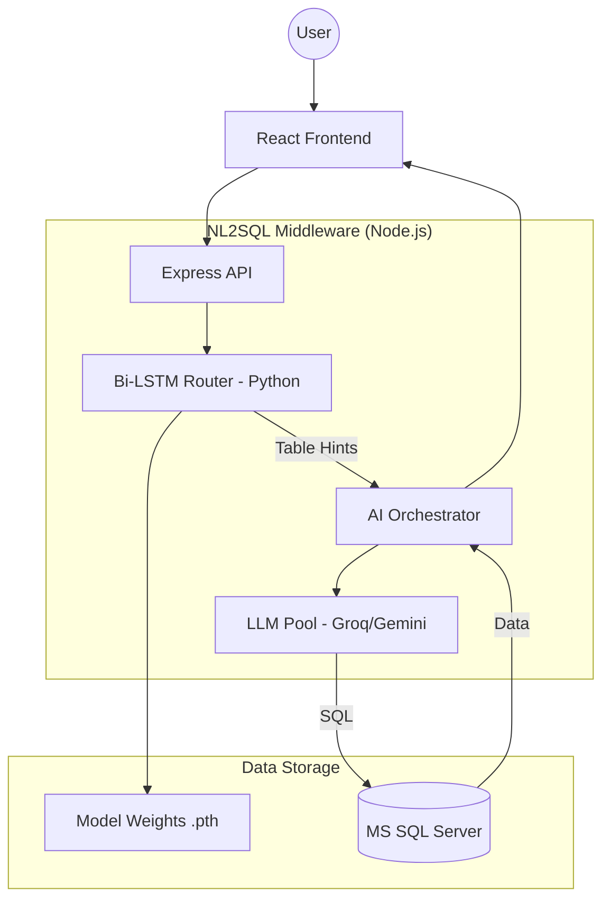

# Code-Level Documentation: COSEC Hybrid NL2SQL Agent (v2.0)

## 1. System Overview
The COSEC Hybrid NL2SQL Agent is an intelligent middleware designed to bridge natural language queries with the Matrix COSEC MS SQL database. Unlike traditional LLM-only approaches, this version utilizes a **Bi-LSTM Neural Router** to ensure deterministic schema mapping and high-reliability query generation.

## 2. Component Diagram (C4 Level 3)


## 3. The Hybrid Intelligence Logic
The core "Intelligent Fail-Safe" from v1.0 (hardcoded correction maps) has been upgraded to a **Predictive Schema Layer**.

### 3.1 Bi-LSTM Routing Phase
Before the LLM processes the query, a dedicated Python process executes `predict_schema.py`. This uses a trained **Bi-directional LSTM** to analyze the semantic sequence of the user prompt.
- **Input**: "who is in the md cabin?"
- **Logic**: The LSTM identifies the sequence pattern mapped to `Mx_VEW_LiveRoomStatus`.
- **Output**: Returns a JSON array of "Target Hints".

### 3.2 Dynamic Context Injection
The Node.js orchestrator receives these hints and injects them into the **System Prompt** dynamically:
```text
LSTM ROUTER PREDICTED TABLES: Mx_VEW_LiveRoomStatus
(Prioritize these tables in your SQL generation.)
```
This forces the LLM to adhere to the correct schema, even if the user query is ambiguous or contains typos.

## 4. Key Components & Scripts
- **`nl2sql_agent.js`**: Main entry point. Handles HTTP requests, child-process execution of the LSTM, and AI failover logic.
- **`predict_schema.py`**: Lightweight inference script utilizing PyTorch to load `cosec_router.pth`.
- **`lstm_skill_model.py`**: The "Brain" training script. Uses PyTorch to train on both manual logs and automated schema-discovered data.
- **`schema_discovery.js`**: An autonomous crawler that updates the model's awareness of the entire database surface area.

## 5. Security & Validation
Every query generated by the AI passes through `sql_validator.js`, which enforces:
- **Read-Only**: Strictly allows `SELECT` and `WITH` statements.
- **Blacklist**: Rejects `DROP`, `DELETE`, `UPDATE`, `EXEC`, and other destructive commands.
- **No-Batching**: Prevents multi-statement SQL injection.

## 6. MLOps Lifecycle
The system follows a continuous improvement loop:
1. **Logs**: All queries are logged in `query_analysis.log`.
2. **Extraction**: `extract_training_data.py` harvests successful patterns.
3. **Training**: `lstm_skill_model.py` updates the weights.
4. **Deployment**: The new `.pth` file is instantly picked up by the production API.
