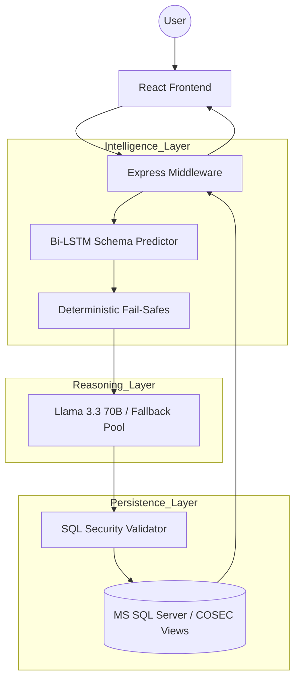

# 🏛️ COSEC Master Intelligence (SAHAY): Enterprise NL2SQL Engine

[]()
[]()
[]()
[]()

**SAHAY** (Secure Attendance & Hybrid Analytical Yield) is a state-of-the-art Natural Language to SQL (NL2SQL) engine meticulously engineered for the **Matrix COSEC** ecosystem. It bridges the gap between complex MS SQL databases and non-technical business leaders, enabling high-fidelity analytical audits through simple, conversational English.

---

## 🌟 The SAHAY Advantage

SAHAY is not just an AI wrapper; it is a multi-layered intelligence platform that combines neural routing with deterministic safety.

- **🧠 Neural Routing (Bi-LSTM)**: Uses a custom-trained Bidirectional Long Short-Term Memory (LSTM) network to predict exactly which database views are required for a query with >99% accuracy.
- **🛡️ Enterprise-Grade Security**: A multi-stage validator ensures that only read-only queries are executed, protecting sensitive organizational data from modification or deletion.
- **⚡ High-Availability Reasoning**: Orchestrates queries across a pool of elite LLMs (Llama 3.3 70B, Gemini, Qwen) with automatic failover and load balancing.
- **📊 Unified Data Fabric**: Seamlessly correlates data across Time-Attendance, Canteen/Cafeteria Management, Visitor Management (VMS), and Access Control (ACS).

---

## 🗺️ System Architecture

The SAHAY engine operates on a robust, modular pipeline designed for low latency and high reliability.



---

## 📂 Project Structure

The project follows a clean, modular enterprise architecture for maximum maintainability:

### ⚙️ `/core` (The Heart)
- **`nl2sql_agent.js`**: The main Express server and orchestration engine. Handles routing, LLM calls, and health monitoring.
- **`sql_validator.js`**: The security gateway. Enforces strict read-only policies using advanced regex and keyword blacklisting.

### 🧠 `/intelligence` (The Brain)
- **`predict_schema.py`**: The neural inference script that powers the Bi-LSTM routing engine.
- **`lstm_skill_model.py`**: The neural network architecture and training logic.
- **`cosec_router.pth` / `model_metadata.pkl`**: The trained brain and its vocabulary mappings.

### 🎨 `/frontend` (The Face)
- **`index.html`**: The Master Portal for the COSEC ecosystem.
- **`react_frontend.html`**: The glassmorphic AI Intelligence Dashboard.
- **`assets/`**: High-resolution brand assets and UI icons.

### 📂 `/docs` (The Documentation)
- **`nl2sql-skill.md`**: The exhaustive T-SQL rules and schema definitions provided to the AI.
- **`sa_architecture_walkthrough.md`**: Beginner-friendly C4 architectural guide.

### 📂 `/data` (The Knowledge)
- **`*.jsonl`**: Rich training datasets used to fine-tune the neural router.
- **`query_analysis.log`**: Persistent audit trail for all AI-generated queries.

### 📜 `/scripts` (Utilities)
- **`start_bot.bat`**: One-click enterprise launcher for the entire system.
- **`start_agent.bat`**: Specialized launcher for the AI Intelligence backend.

---

## 🛠️ Installation & Dependencies

### 1. Prerequisites
- **Node.js** (v18+ recommended)
- **Python** (v3.10+ recommended)
- **MS SQL Server** (with COSEC database and views installed)

### 2. Backend Dependencies (Node.js)
```bash
npm install express mssql dotenv cors
```

### 3. Intelligence Dependencies (Python)
```bash
pip install torch numpy pickle-mixin
```

### 4. Database Setup
Ensure that the following views are created in your `COSEC_DEMO` database:
- `Mx_VEW_DailyAttendance`
- `Mx_VEW_DailyCnteenEvts`
- `Mx_VEW_VistorReport`
- `Mx_VEW_LiveRoomStatus`
- `Mx_VEW_ControllerList`

---

## 🏁 Quick Start

1.  **Clone & Install**:
    Follow the installation steps above to set up your environment.
2.  **Environment Setup**:
    Create a `.env` file in the root directory:
    ```env
    DB_USER=your_db_user
    DB_PASSWORD=your_db_password
    DB_SERVER=your_db_server
    DB_NAME=COSEC_DEMO
    GROQ_API_KEY=your_groq_api_key
    ```
3.  **Run with One Click**:
    Simply double-click `scripts/start_bot.bat` to launch the server and the dashboard simultaneously.

---

## 🔐 Security Protocols

- **Read-Only Lock**: No `INSERT`, `UPDATE`, or `DELETE` commands can ever pass the validator.
- **View-Level Abstraction**: The AI never sees raw tables, only curated analytical views.
- **Zero Hallucination**: If the LSTM router cannot find a confident schema match, the system gracefully degrades rather than generating invalid SQL.

---

## 🏛️ Architectural Walkthrough

For a detailed, beginner-friendly explanation of how SAHAY works—including its C4-level architecture, code-dependency stories, and real-world use cases—see our:

👉 **[First-Class Architecture & Code Guide](docs/sa_architecture_walkthrough.md)**

---

&copy; 2026 **Matrix Comsec Pvt. Ltd.** | *Right People in Right Place at Right Time*
