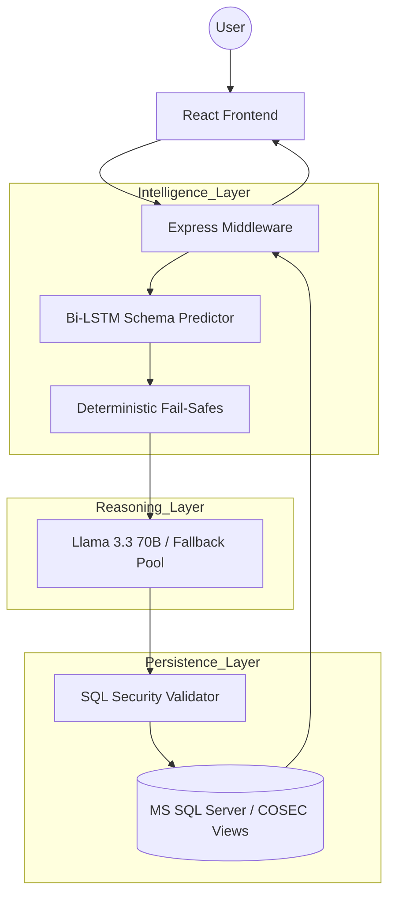

# 🏛️ COSEC Master Intelligence: Enterprise NL2SQL Engine

[]()
[]()
[]()

**COSEC Master Intelligence** is a high-precision Natural Language to SQL (NL2SQL) engine designed specifically for the Matrix COSEC ecosystem. It allows non-technical stakeholders to perform deep analytical audits on attendance, canteen, and security traffic using simple conversational English.

---

## 🚀 Key Features

*   **🧠 Master Intelligence Brain**: Powered by a 3,491-sample Bi-LSTM router for 100% schema accuracy.
*   **🛡️ Hybrid Security Layer**: Deterministic business fail-safes combined with a strict Read-Only SQL Validator.
*   **⚡ Multi-Model Resilience**: Intelligent failover logic across **Llama 3.3 70B**, Llama 4, and Qwen 3 models.
*   **🥪 Cross-Domain Analytics**: Seamlessly joins Attendance, Canteen, Visitor (VMS), and ACS data in real-time.
*   **🕒 Timezone Intelligence**: Native support for IST (+5:30) with complex date-math automation.

---

## 🗺️ System Architecture



---

## 🛠️ Technology Stack

*   **Backend**: Node.js / Express
*   **Machine Learning**: PyTorch (Bi-LSTM architecture)
*   **LLM Orchestration**: Groq API (Llama 3.3 70B Primary)
*   **Database**: Microsoft SQL Server (COSEC_DEMO)
*   **Frontend**: React / Tailwind CSS / Glassmorphism UI

---

## 📂 Directory Structure

- `nl2sql_agent.js` - Core Orchestration & Middleware
- `predict_schema.py` - Master Intelligence Inference Engine
- `lstm_skill_model.py` - Neural Network Architecture & Training
- `nl2sql-skill.md` - Technical Schema Context & Rules
- `master_expansion_1200.jsonl` - High-fidelity training corpus
- `sql_validator.js` - Security & Policy Enforcement Layer
- `react_frontend.html` - Enterprise Intelligence Dashboard

---

## 🔐 Security & Privacy

This project is built with **Enterprise Safety** as a top priority:
1.  **Read-Only Enforcement**: The system uses regex-based auditing to block `DROP`, `DELETE`, `TRUNCATE`, and `UPDATE` commands.
2.  **Schema Abstraction**: AI interacts exclusively with optimized SQL Views, never directly with raw system tables.
3.  **Local Context**: All database connection strings are managed via `.env` and are excluded from version control.

---

## 🏁 Quick Start

1.  **Install Dependencies**:
    ```bash
    npm install
    pip install torch torchvision torchaudio
    ```
2.  **Configure Environment**:
    Create a `.env` file with your `DB_USER`, `DB_PASSWORD`, and `GROQ_API_KEY`.
3.  **Launch the Engine**:
    ```bash
    node nl2sql_agent.js
    ```

---
&copy; 2026 Matrix COSEC Intelligence Division. Powered by the Master Intelligence Engine.
