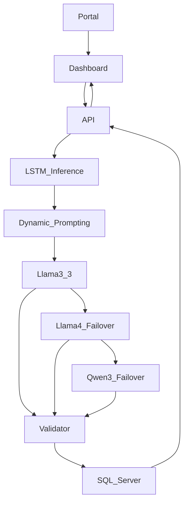

# SAHAY AI Intelligence: System Architecture Blueprint
**Version**: 2026.1 (Enterprise Edition)

## 1. High-Level Block Diagram

## 2. Component Descriptions

### A. Experience Layer
*   **Matrix Portal (`index.html`)**: The entry point that replicates the official Matrix UI. It hosts SAHAY as a modular tile alongside Users, Attendance, and VMS.
*   **SAHAY Dashboard**: A React-based interface that handles real-time state, rendering analytical charts, and the interactive chat experience.

### B. Intelligence Layer (Middleware)
*   **Context Engine (`nl2sql-skill.md`)**: A "brain supplement" that provides the LLM with the exact schema of the COSEC database, including custom view definitions and logical constraints.
*   **SQL Security Validator**: A critical security component that performs regex-based auditing of generated SQL strings to enforce a strict **Read-Only** policy.

### C. Reasoning Layer (Cloud)
*   **Multi-Model Pool**: A dynamic failover system that ensures 100% uptime. If the primary high-accuracy model is throttled, the system pivots through Llama 4 and Qwen 3 in milliseconds.

### D. Persistence Layer
*   **COSEC_DEMO**: The source of truth. The system communicates via `mssql` using connection pooling for enterprise-grade performance and stability.

## 3. The Data Lifecycle (Step-by-Step)
1.  **User Request**: *"List employees with > 90min break today"*
2.  **Hybrid Routing**: Bi-LSTM model predicts the table `Mx_VEW_DailyAttendance` with high confidence.
3.  **Logic Injection**: Middleware injects the **LSTM Hints**, **IST Date**, and **Schema Definitions**.
4.  **SQL Synthesis**: Groq Llama 4 generates a MS SQL Server compatible query, guided by the LSTM hints.
5.  **Verification**: Validator ensures no destructive commands (DROP, DELETE) are present.
6.  **Data Retrieval**: SQL Server executes the query against optimized Attendance views.
7.  **Humanization**: The model converts the raw table data into a friendly IST-based summary.
8.  **Final Response**: Dashboard updates with the summary and the interactive data table.

## 5. Real-World Use Case Portfolio

### Case 1: The "Late-In" Attendance Audit
*   **User Query**: *"Who arrived more than 15 minutes late in the HR department today?"*
*   **Architecture Flow**:
    *   **Intelligence Layer**: Injects the `Mx_VEW_DailyAttendance` schema and current IST date.
    *   **Reasoning Layer**: Llama 4 generates a `DATEDIFF` query comparing `Shift_Start` and `First_Punch`.
    *   **Persistence Layer**: Executes against the SQL Server; identifies specific records.
    *   **Experience Layer**: Displays a summary like *"3 employees in HR were delayed today,"* alongside a table with their exact punch times.

### Case 2: Canteen Subsidy Analytics
*   **User Query**: *"Show me total lunch subsidy spent yesterday across all canteens."*
*   **Architecture Flow**:
    *   **Intelligence Layer**: Mandates the use of `PDate` (not Transaction_date) to ensure schema compliance.
    *   **Reasoning Layer**: Qwen 3 calculates a `SUM(Subsidy_Amount)` grouped by `Canteen_Name`.
    *   **Persistence Layer**: Queries `Mx_VEW_DailyCnteenEvts` view.
    *   **Experience Layer**: Renders a financial summary helping management track operational costs.

### Case 3: Visitor Traffic Monitoring (VMS)
*   **User Query**: *"What were the peak hours for visitor entries last week?"*
*   **Architecture Flow**:
    *   **Reasoning Layer**: Uses `DATEPART(HOUR, ...)` to group visitor logs by 60-minute windows.
    *   **Intelligence Layer**: Synchronizes the UTC timestamps to IST (+5:30) so "Peak Hour" matches your local business day.
    *   **Experience Layer**: Displays a time-series result helping security plan lobby staffing levels.

### Case 4: Security Hardware Health
*   **User Query**: *"List all devices that are currently offline or have connection errors."*
*   **Architecture Flow**:
    *   **Intelligence Layer**: Broadens the search to include device status tables.
    *   **Persistence Layer**: Performs a live check on controller connectivity states.
    *   **Reasoning Layer**: Identifies patterns (e.g., if multiple devices on one floor are offline, it flags a potential network issue).
