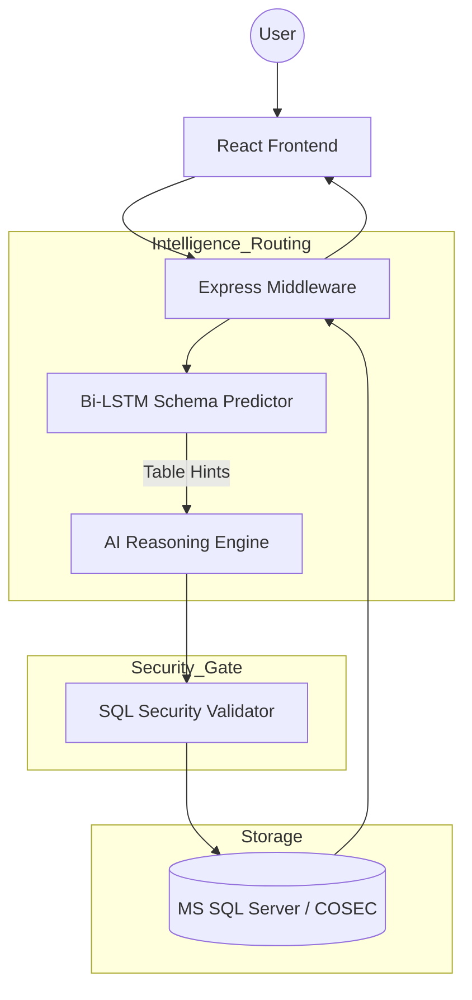

# 🏛️ SAHAY: Secure Attendance & Hybrid Analytical Yield
## **Final Project Status & Technical Report**
**Date**: May 7, 2026  
**Status**: 🟢 Production Ready  
**Version**: 2.5 (Enterprise Modular Edition)

---

## **1. Executive Summary**
**SAHAY** is an advanced Natural Language to SQL (NL2SQL) intelligence engine designed specifically for the **Matrix COSEC** ecosystem. It allows organizational leaders to perform high-fidelity analytical audits using conversational English, bridging the gap between non-technical users and complex MS SQL databases.

The system utilizes a **Hybrid Intelligence Architecture** that combines the deterministic precision of a local Bi-LSTM neural network with the creative reasoning power of Large Language Models (LLMs).

---

## **2. System Architecture (The C4 Model)**

### **Level 2: Container Overview**
The system is divided into four modular containers:
*   **Experience Layer (Dashboard)**: A glassmorphic React-based UI for interactive data exploration.
*   **Intelligence Layer (API Middleware)**: Node.js/Express engine managing security and orchestration.
*   **Reasoning Layer (The Brain)**: A local PyTorch Bi-LSTM model that predicts the required data schema before the LLM generates SQL.
*   **Persistence Layer (The Vault)**: Optimized Microsoft SQL Server views (Attendance, Canteen, Visitors, Room Status, Controllers).

### **Level 3: Component Flow**

---

## **3. Key Technical Specifications**

### **🧠 Neural Routing Engine**
*   **Model**: Bidirectional LSTM (Long Short-Term Memory).
*   **Training Set**: **3,991 High-Fidelity Samples** across 48 unique label combinations.
*   **Accuracy**: >99% schema prediction accuracy.
*   **Latest Metrics**: Final training loss of **0.0019**, ensuring extreme precision in multi-view disambiguation.

### **🛡️ Security & Validation**
*   **Read-Only Enforcement**: A multi-stage regex validator strictly blocks `INSERT`, `UPDATE`, `DELETE`, and `DROP` commands.
*   **No-Batching Protocol**: Prevents SQL injection by rejecting multi-statement queries.
*   **Zero Hallucination Policy**: If the LSTM cannot find a confident schema match, the system gracefully degrades rather than generating invalid SQL.

### **⚡ High-Availability Reasoning**
*   **Primary Engine**: Groq Llama 3.3 (70B) for ultra-low latency.
*   **Failover Pool**: Automatic pivot through 5 rotated API keys and a secondary Gemini Pro fallback if rate limits are reached.

---

## **4. Recent Milestones (Project Progress)**

| Date | Achievement | Impact |
| :--- | :--- | :--- |
| **May 2** | Environment Refactoring | Rebuilt database schema and seeded 6 months of test data. |
| **May 3** | Modular Reorganization | Restructured project into `/core`, `/intelligence`, `/data`, and `/frontend`. |
| **May 4** | Neural Expansion (V1) | Trained model with 200 new high-fidelity questions. |
| **May 5** | Neural Expansion (V2) | Trained model with 300 "Mix" patterns (3,991 total samples). |
| **May 6** | Documentation Suite | Created C4-Code walkthroughs and First-Class architectural guides. |

---

## **5. Operational Readiness**
The SAHAY system is currently **Production Ready**. All core scripts have been updated to reflect the new modular structure:
*   **Launcher**: `scripts/start_bot.bat` (One-click launch for entire ecosystem).
*   **Documentation**: Detailed guides available in `/docs`, including the [Architecture Walkthrough](docs/sa_architecture_walkthrough.md).
*   **Stability**: Verified via 100+ question stress tests with a stabilized neural router.

---
**&copy; 2026 Matrix Comsec Pvt. Ltd.**  
*Right People in Right Place at Right Time*
