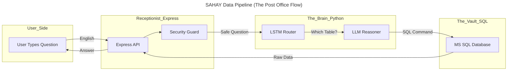

# 🏗️ SAHAY Architecture & Code: The "First-Class" Guide

Hello there! I'm your **Senior Code Analyst**. I've been building "digital cities" for over 10 years, and today I’m going to show you how **SAHAY** works. 

Imagine SAHAY is a **Magic Translation Library**. People come in speaking normal English, and the library finds the exact book (data) they need from a giant, complex vault.

---

## 1. Architectural Working: How the "Digital City" Moves

Using the **C4 Model**, we look at our system in four layers of detail. Think of it like zooming in on a map: from the whole country down to a single house.

### 📍 Level 1: The Context (The Big Picture)
**Analogy**: A Customer talking to a Shopkeeper.
*   **The User**: A business boss who wants to know "How many people were late today?"
*   **SAHAY**: The smart shopkeeper who listens, understands, and gets the answer.

### 📍 Level 2: The Containers (The Big Buildings)
Inside the SAHAY country, we have four main buildings:
1.  **The Dashboard (Front Door)**: Where the user types their question.
2.  **The Agent (The Receptionist)**: Takes the question and manages the process.
3.  **The Brain (The Translator)**: A special room where we turn "English" into "Computer Code".
4.  **The Vault (Database)**: Where all the actual attendance and visitor files are kept.

### 📍 Level 3: The Components (The Machines Inside)
Inside the **Agent** building, we have:
*   **The Guard**: Checks if the question is safe (e.g., "Don't let anyone delete files!").
*   **The Router**: Decides which "aisle" of the vault to look in (Attendance vs. Visitors).

### 📍 Level 4: The Code (The Instructions)
This is the "recipe" written inside the machines. Let's look at the flow:

---

## 2. Line-by-Line: The "Magic Ingredients" (Dependencies)

Every program uses "Tools" (Dependencies). Think of these like a chef using a blender or a knife instead of building them from scratch.

### 📦 The Node.js Tools (The Office Supplies)
These are found in `package.json`:

| Tool (Dependency) | What is it? | Why we use it? (The Story) |
| :--- | :--- | :--- |
| **`express`** | The Receptionist | It stands at the front door and waits for someone to ring the bell (a web request). |
| **`mssql`** | The Librarian | This tool knows how to talk to the giant "Vault" (Microsoft SQL Server) to get files. |
| **`dotenv`** | The Secret Drawer | It hides our passwords and keys so no one can see them if they peek through the window. |
| **`cors`** | The ID Checker | It ensures only "friendly" websites are allowed to talk to our receptionist. |

### 🧠 The Python Tools (The Brain Cells)
These are found in `predict_schema.py`:

| Tool (Dependency) | What is it? | Why we use it? (The Story) |
| :--- | :--- | :--- |
| **`torch` (PyTorch)** | The Neural Network | This is the actual "artificial brain." It learns patterns from the 3,691 questions we taught it. |
| **`numpy`** | The Calculator | Computers love numbers. This tool helps the brain do millions of math problems in a blink. |
| **`json`** | The Note Taker | It helps the brain write down its thoughts in a way the Receptionist can understand. |
| **`pickle`** | The Memory Box | It "pickles" (saves) the brain's vocabulary so it doesn't forget words when it restarts. |

---

## 🌟 A Real-Life Example (Use Case)

**The Question**: *"Show me the names of visitors who came for a meeting today."*

1.  **Receptionist (`express`)**: "Welcome! Someone is asking about visitors. Let me check the safety."
2.  **Security Guard**: "Scanning... No 'Delete' commands found. Safe to proceed."
3.  **The Brain (`torch`)**: "I recognize the word 'visitors'. My math tells me I should look in the `Mx_VEW_VistorReport` table."
4.  **The Reasoner (LLM)**: "I will write a command: `SELECT VisitorName FROM Mx_VEW_VistorReport WHERE Purpose='Meeting'`."
5.  **The Librarian (`mssql`)**: "I'm heading to the vault... Here are the files for John Doe and Jane Smith!"
6.  **Receptionist**: "Here is your answer, Boss: John Doe and Jane Smith were here for meetings!"

---
*This walkthrough was created using the **C4-Code** standard to ensure every "gear" in our machine is documented and understood.*
